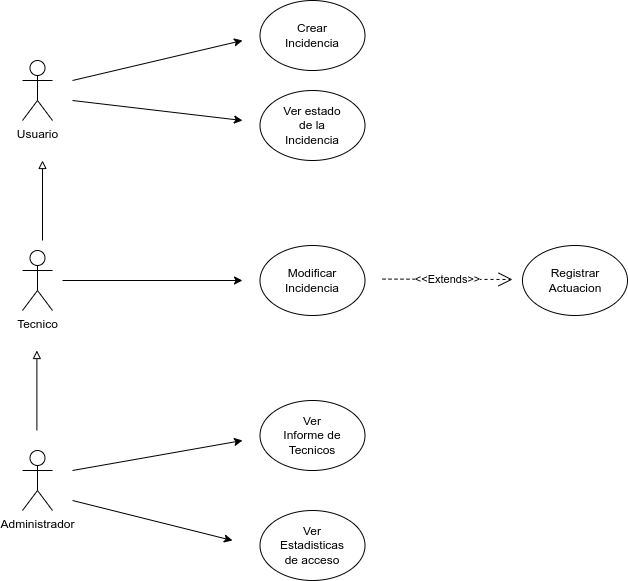

Grup11

Integrants: Fabrizzio Rodriguez Gonzales y Joel Chica Herrero

El principal objectiu d’aquest projecte és practicar els coneixements sobre la gestió i desenvolupament d’un projecte informàtic real. Això implicarà treballar amb la metodologia SCRUM per organitzar i planificar el treball a l’equip en sprints, tasques de seguiment amb l’ús de TAIGA i fer versions del codi amb GitHub. També s’implementarà una base de dades per gestionar el treball independent o amb dependències de les dades. L’aplicació realitzada serà una plataforma per a la gestió de les incidències a que un centre hauria de fer front. Hi haurà diversos tipus d’usuaris afectats i demandants de la plataforma, com el professorat, els tècnics, etc..

